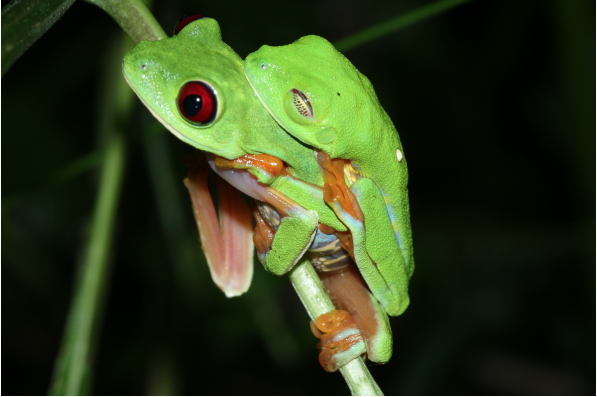
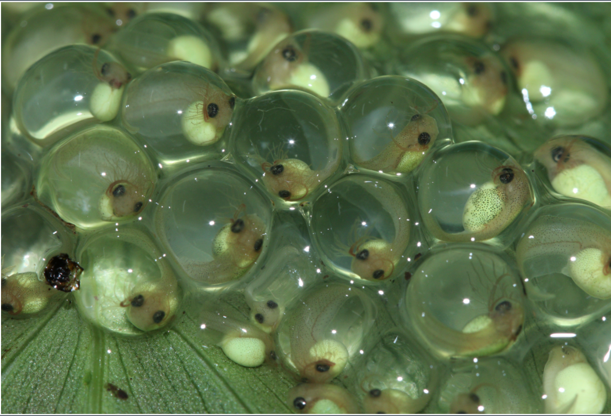
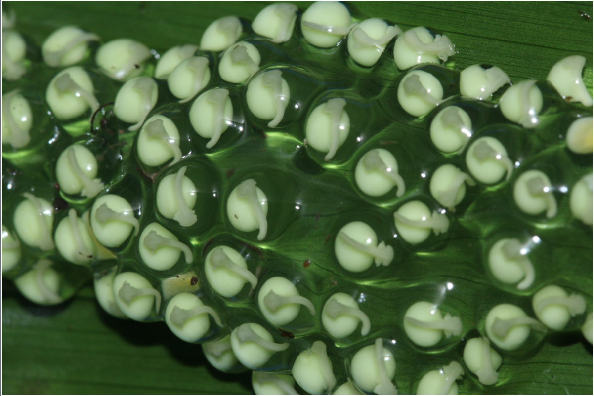
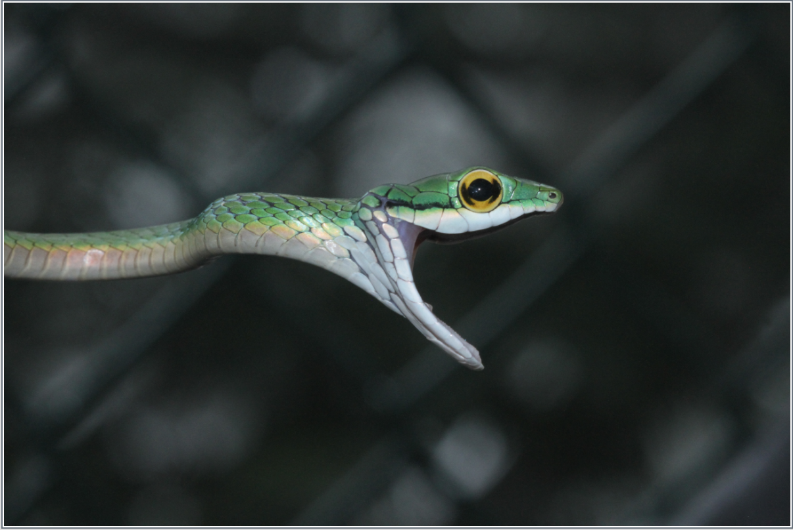
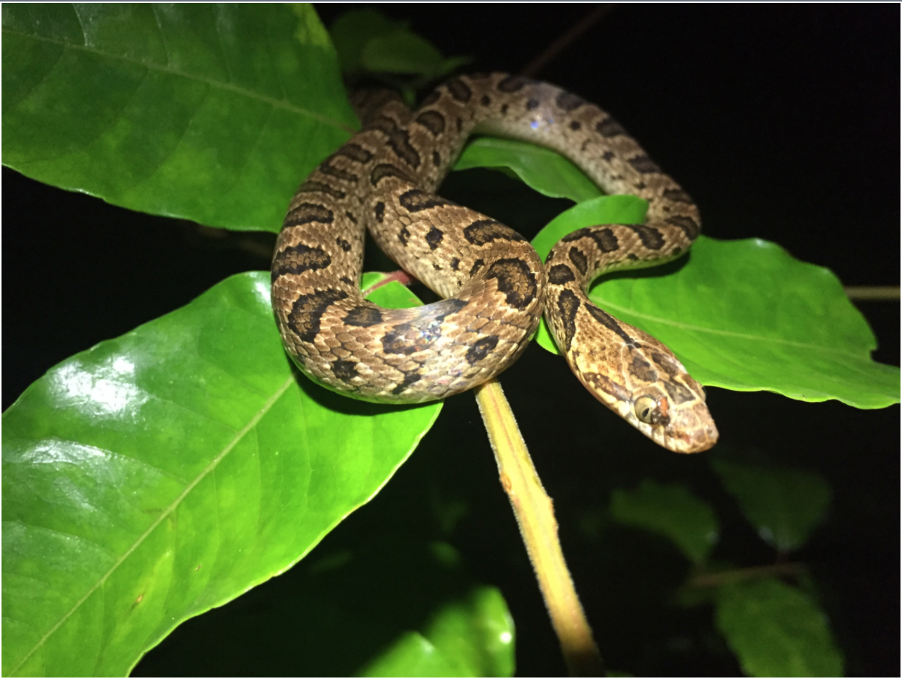
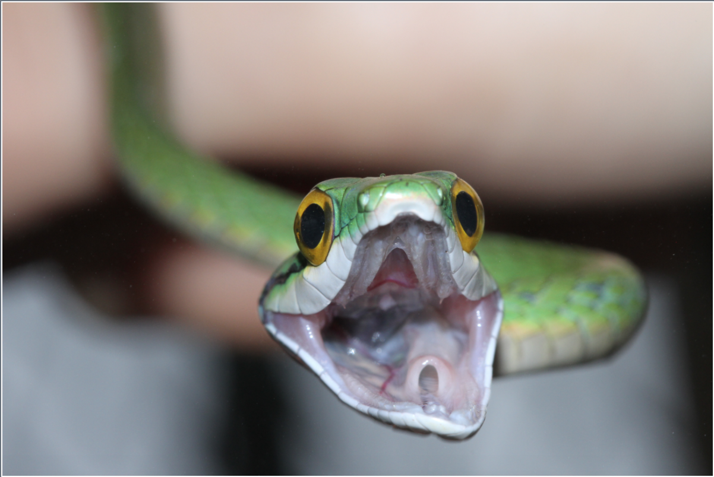
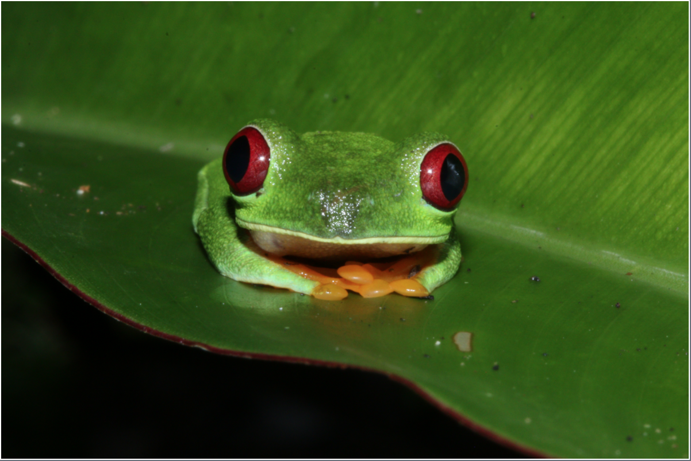
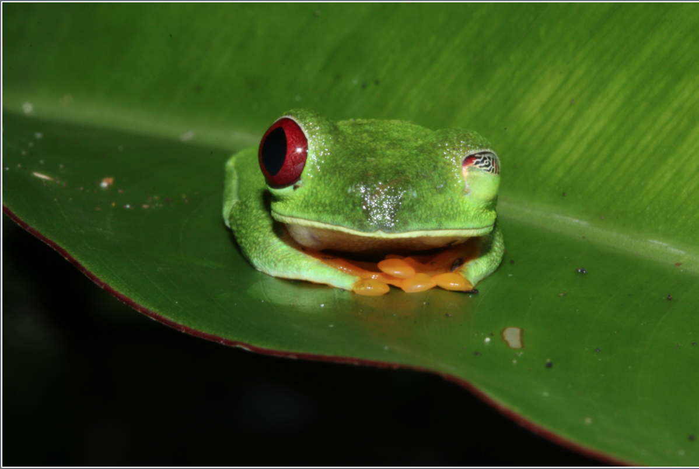

# Project Overview

 

The original [study](https://github.com/bguell/data-reanalysis-assignment/blob/master/Gomez-Mestre%2C%20Warkentin_2007.pdf) I have chosen to replicate examined differences in selective trade-offs and responses to predation in two closely related and syntopic treefrog species: *Agalychnis callidryas* and *A. spurrelli*. The authors performed field surveys to collect data on natural spontaneous hatching timings and natural predation on egg clutches of the two species. Authors also performed predation experiments using snakes for predation on eggs and fish for predation on hatchlings.

Their specific null hypotheses were outlined explicitly, "**(1)** both species experience similar levels of egg predation; **(2)** they have the same pattern of undisturbed or spontaneous hatching; **(3)** their escape hatching responses to snake attack and flooding are similar; and **(4)** early hatching increases vulnerability to aquatic predators in *A. spurrelli*, as it does in *A. callidryas*."

This paper used multiple data sets from various authors. All data was collected in the field, but in different years and by different authors. They performed a suite of statistical analysis, but the main ones were as follows:

1. "The overall proportion of monitored clutches predated in the field, escape hatching success in snake predation experiments, and proportion of hatchlings surviving fish predation were all analysed using generalized linear models with an underlying binomial distribution and a logit link function in PROC GENMOD."

2. "We performed a log-linear analysis of the number of clutches of each species that were predated and undisturbed on each of 16 nights when both were present. Model parameters were estimated through maximum likelihood using PROC CATMOD, assuming an underlying Poisson distribution."

3. "We tested for effects of embryo development on escape success in snake attacks using generalized linear models."

4. "The hatching response of *A. spurrelli* to underwater submergence was tested against its unflooded controls by fitting a Cox regression model using PROC PHREG"

5. "The effects of hatching age on the proportion of hatchlings surviving in the fish predation experiments was analysed with a generalized linear model, including fish size as a covariate."




> Note: I will be reanalyzing data for data sets which I was able to obtain. I will reproduce analysis for the following:


1. Data analysis of field survey undisturbed predation observations including the corresponding data manipulation, data summarization and descriptive statistical analysis, and visualization.

2. GLM to test for effects of age and species and their interaction on escape success of embryos during snake predation experiments and corresponding data manipulation and visualization

3. GLM to test for effects of age and fish size on hatchling/tadpole survival in fish predation experiments and corresponding data manipulation and visualization


**SO LETS GET STARTED!!!**

**********
**********
**********

# Field Surveys of Undisturbed Clutches



## Read in data file
First we'll load *several cvs files* from the web for the different chapters of this reanalysis project! Here's the first!
```{r}
library(curl) #load necessary package for uploading data from Github

f <- curl("https://raw.githubusercontent.com/bguell/data-reanalysis-assignment/master/undisturbed%20raw.csv") #read in csv file from Github
d <- read.csv(f, header = TRUE, sep = ",", stringsAsFactors = FALSE)
head(d) #see data and column names

```

## Data summary statistics

Now that the raw data for field surveys of undisturbed clutches are loaded, lets begin with some basic data summarization which are also found in the paper. First, lets look at some basic summary statistics of clutch size for both species. We'll need to find the **mean**, **standard deviations**, and **range** of the clutch sizes for each species:
```{r}
# using dplyr:
library(dplyr)
dd = d %>% 
  group_by(species) %>%
  summarise(mean= mean(number_of_eggs), SD= sd(number_of_eggs), min= min(number_of_eggs), max= max(number_of_eggs)) # mean of prop_hatch by day!
dd

library(stargazer)
library(knitr)
kable(dd,title="Mean, SD, & Range for frog species",digits=3)
```

Here we can easily obtain the mean, standard deviation, and range of clutch sizes for each species! Woohoo

## Proportion of predated clutches
Next, lets look at the **overall proportion of predated clutches** for each species and compare them using a *test of equal proportions*:

> Note: since the data frame I obtained doesn't have info about the total number of observed clutches, we need to calculate the total N for each species. We can "back calculate" this since we know the proportion of predated clutches for each species from the data reported in the paper, **0.40** and **0.48** for *callidryas* and *spurrelli* respectively.

```{r}

lc=length(d$species[d$species=="callidryas"]) #number of predated clutches for callidryas
lc
Ncalidryas= 182 *.40
Ncalidryas

ls=length(d$species[d$species=="spurrelli"]) #number of predated clutches for spurrelli
ls
Nspurrelli= 19 *.48
Nspurrelli
```

And now lets make a small table of these results:
```{r}
ll= data_frame(c(lc, ls), c(Ncalidryas, Nspurrelli)) 
x= c("Predated Clutches", "Sample Size")
colnames(ll) = x
ll
ll= ll %>%
  mutate(Species = c("Callidryas", "Spurrelli")) %>%
  select(Species, `Predated Clutches`, `Sample Size`)
ll

library(stargazer)
kable(ll,title="Number of predated cluthces and sample sizes",digits=3)
```

We can now incorporate these numbers into a two sample proportion test:

```{r}
prop.test(x=c(73,9), n=c(182,19))
```
Clearly the proportions predated for each species were not significaly different from each other. When we compare this to the original data reported; "The overall proportion of predated clutches was high for
both species, and not signiWcantly diverent (0.40 and 0.48 for
A. spurrelli and A. callidryas, respectively; X^2^(1,3662) = 0.09, P = 0.76)." As we can see, our chi-squared vaslues are abit off and our p-values as well, but they both analysis show similar results. These differences are likely due to underlying corrections and other methods which differ between the proportion tests which we used. In addition, it probably has something to due with the the fact that we derived the data to analyze (because it was not given in our data aquisiion), while the original authors used raw data.

## Data wrangling time!

Next let's make some **figures to visualize** this data! We'll first need to *seriously wrangle* this data since there are multiple colums for observations which should be in just one... lets use dplyr and tidyr!!! yay data clean up time!
```{r}
library(dplyr)
library(tidyr)
d= select(d, 1:16) #only need to plot days 4-9
dd=gather(data = d, day, prop_hatch, D4.am:D9.pm, -year, -species, -clutch, -number_of_eggs) # accumulate all observations into one column named prop_hatch
head(dd)
str(dd) #thats more like it! great!

#but lets separate the Day # from the am and pm if we can...
dd = separate(dd, day, c("day", "time_of_day"))
head(dd)
str(dd) #wow yay! that worked so well! yay me!


#now lets get species specific data so we can plot these as separate figures by species
ddc = filter(dd, species =="callidryas")
head(ddc)
dds = filter(dd, species == "spurrelli")
head(dds)
```

Now lets get some summary statistics to actually plot!
```{r}
ddc= ddc %>% group_by(day, time_of_day) #group by day colum to summarize by day!

mphc=ddc %>% summarise(mean_prop= mean(prop_hatch), SE= sd(prop_hatch)/sqrt(length(prop_hatch))) # mean of prop_hatch by day!
mphc

mphc= unite(mphc, "day_time", c("day", "time_of_day")) #and now combine the day and time of day colums back for easier plotting
mphc

mphc=mutate(mphc, time_of_day = c("am", "pm","am", "pm","am", "pm","am", "pm","am", "pm","am", "pm")) # add column to distingusih am and pm
mphc

dds= dds %>% group_by(day, time_of_day) #group by day colum to summarize by day!

mphs=dds %>% summarise(mean_prop= mean(prop_hatch), SE= sd(prop_hatch)/sqrt(length(prop_hatch))) # mean of prop_hatch by day!
mphs

mphs= unite(mphs, "day_time", c("day", "time_of_day")) #and now combine the day and time of day colums back for easier plotting
mphs

mphs=mutate(mphs, time_of_day = c("am", "pm","am", "pm","am", "pm","am", "pm","am", "pm","am", "pm")) # add column to distingusih am and pm
mphs


```

## Figures yay PLOT PLOT PLOT!

Excellent! Now lets go ahead and plot those to see what it looks like!
```{r}
library(ggplot2)

legend_title= "Time of day"

gc= ggplot(data=mphc, aes(x=day_time, y=mean_prop)) + 
  geom_bar(stat="identity", aes(fill=time_of_day)) + #use barplots w/time of day filled w/color
  geom_errorbar(aes(ymin=mean_prop-SE, ymax=mean_prop+SE), width=.2, position=position_dodge(.9), color="black") + #add black error bars
  labs(x= "Age (days)", y= "Sponanteous hatching \n (proportion hatched eggs)") + #make labels for axis
  theme_bw(base_size = 11, base_family = "Times") + #make theme in Times New Roman and b/w
  annotate("text", x = 2, y = 0.5, label = "(b) A. callidryas", fontface= "italic") + #add italicized text to figure!
  scale_fill_manual(legend_title, values = c("blue", "black")) # change "fills" to blue for day and black for night
gc

#and again same for spurrelli
gs= ggplot(data=mphs, aes(x=day_time, y=mean_prop)) + 
  geom_bar(stat="identity", aes(fill=time_of_day)) +
  geom_errorbar(aes(ymin=mean_prop-SE, ymax=mean_prop+SE), width=.2, position=position_dodge(.9), color="black") +
  labs(x= "Age (days)", y= "Sponanteous hatching \n (proportion hatched eggs)") + #break up the title into two rows using "\n"
  theme_bw(base_size = 11, base_family = "Times") +
  annotate("text", x = 2, y = 0.5, label = "(a) A. spurrelli", fontface= "italic") +
  scale_fill_manual(legend_title, values = c("blue", "black"))
gs
```

Just for fun, we could try putting on same plot somehow? maybe something like this?
```{r}
library(grid)
grid.newpage()
grid.draw(rbind(ggplotGrob(gs), ggplotGrob(gc), size = "last"))
# Breaking up the title sure seemed to help! looks a lot better now! YAY :)
```

We can take a look at the original figure and see how much better the R made one is! Better colors, better legends, and more information about the x axis. But overall, they are the same figures.


**********
**********
**********

# Predation Experiments



## Read in data file
Next let's load the data for the predation experiments! This data is a lot more uniform, and will require much less wrangling and more of simple subsetting for certain tests we will run! Yay!
```{r}
f <- curl("https://raw.githubusercontent.com/bguell/data-reanalysis-assignment/master/predation%20experiments.csv") #read in csv file from Github
d <- read.csv(f, header = TRUE, sep = ",", stringsAsFactors = FALSE)
head(d) #see data and column names
```
This dataset is a compilation of the snake and fish predation experiments! We'll have to subset data in order to only run models on each experiment and the predictors we chosse.Lets start with the snake predation experiment and data.

## Snake predation experiments


```{r}
library(lme4) #require package to fun GLMM
library(car) #require package to allow for Anova on GLMM and effects of predictors
library(dplyr)
```

### Interactive effect of age and species
```{r}
#lets filter out only observations for snake predation experiments
dt = filter(d, predation_type =="snake")
head(dt)

m=glm(survival_prop~age*species, family = "binomial", weights = initial, data = dt) # glm for escape success with age and species interaction. Binomail distrubition using proportions escaped as response with initial number of trials as weights.
m
summary(m)
Anova(m) #allows for summary of main effects of age, species, and their interaction
```
Firstly, we see that we get an "error" becasue we are running **proportion data** through a *binomial* GLM instead of using a beta regression. However, the "weights" arguments allows us to use proportion data as long as we have the inital number of trials of which we got the proportion from. In addidion, this is a replication of how the authors did hte analysis in the original study, and in my reading of literature in our field, this practice is very common.

Let's compare our results with the original reported anaysis. Both our reanalysis and the authors' original analysis found a significant species x age interaction:

* **Original results**; "(X^2^(1,59) = 15.50, P < 0.0001; Fig. 2)" 
* **Our results**; "(X^2^= 57.508, P < 3.366e-14)

Here, although our summary statistic is off (likely due to method of p-value extraction), we see that our results corroboate the interpretation of the authors. We see in the figures below that escape success in snake predation experiments increased more between 5 and 6 days (the modal hatching age) in *A. spurrelli* than it did between 7 and 8 days (the modal hatching age) in *A. callidryas*.

### Effect of age on *A. callidryas* escape success:
```{r}
dc = filter(d, predation_type =="snake")
dc = filter(dc, species=="callidryas")
head(dc)
m=glm(survival_prop~age, family = "binomial", weights = initial, data = dc)
summary(m)
Anova(m) # main effect of age on escape hatching
```
Let's compare our results with the original reported anaysis. Both our reanalysis and the authors' original analysis found a significant effect of age on escape success in *A. callidryas*:

* **Original results**; "(X^2^(3,44) = 25.22, P < 0.0001)" 
* **Our results**; (X^2^= 57.712, P < 6.427e-13)

Similarly as before, here we see that our Chi-squared values are off, but we end up with very conclusive results which align with what the authors originally found. We interpret these results as showing that escape success in *A. callidryas* increased with age/development.

### Effect of age on *A. spurrelli* escape success:
```{r}
ds = filter(d, predation_type =="snake")
ds = filter(ds, species=="spurrelli")

m=glm(survival_prop~age, family = "binomial", weights = initial, data = ds)
summary(m)
Anova(m) # main effect of age on escape hatching
```
Let's compare our results with the original reported anaysis. Both our reanalysis and the authors' original analysis found a significant effect of age on escape success in *A. spurrelli*:

* **Original results**; "X^2^(1,12) = 12.56, P = 0.0004)" 
* **Our results**; (X^2^= 136.47, P < 2.2e-16)

Once again we see different Chi-squared values but robust and convincing interpretable results. We find that escape success in *A. spurrlli* increased with age/development, just as the original paper also conlcudes from these analysis.

### Visualization! Figure PLOT PLOT PLOT!
```{r}
head(d)
head(dc) # only the callidryas snake predation data

spc= dc %>% group_by(age) #group by age colum to summarize by data!

spc= spc %>% summarise(sample_size= n(), mean_survival= mean(survival_prop), SE= sd(survival_prop)/sqrt(length(survival_prop))) # sample size and mean and SE of survival_prop by age!
spc

#and same for spurrelli
head(ds)
sps= ds %>% group_by(age) #group by day colum to summarize by age!

sps= sps %>% summarise(sample_size= n(), mean_survival= mean(survival_prop), SE= sd(survival_prop)/sqrt(length(survival_prop))) # sample size and mean and SE of survival_prop by age!
sps

library(scales)
library(ggplot2)

gc= ggplot(data=spc, aes(x=age, y=mean_survival)) +
  geom_bar(stat="identity", fill= "black") + #use barplots w/age filled all black
  geom_errorbar(aes(ymin=mean_survival-SE, ymax=mean_survival+SE), width=.2, position=position_dodge(.9), color="black") + #black error bars
  labs(x= "Age (days)", y= "Escape hatching success \n (proportion hatched eggs)") + #make labels for axis
  theme_bw(base_size = 11, base_family = "Times") + #make theme in Times New Roman and b/w
  annotate("text", x = 4.8, y = 1, label = "(b) A. callidryas", fontface= "italic") + #add italicized text (species name) to figure!
  scale_y_continuous(breaks= pretty_breaks(n=5)) + # allows for making "pretty" breaks on y axis... shows 5 breaks
  geom_text(aes(y = 0.03, label = spc$sample_size), color= "white", vjust = 0) # add white numbers of the sample sizes for each age
gc

#and again same for spurrelli
gs= ggplot(data=sps, aes(x=age, y=mean_survival)) + 
  geom_bar(stat="identity", fill= "black") +
  geom_errorbar(aes(ymin=mean_survival-SE, ymax=mean_survival+SE), width=.2, position=position_dodge(.9), color="black") +
  labs(x= "Age (days)", y= "Escape hatching success \n (proportion hatched eggs)") +
  theme_bw(base_size = 11, base_family = "Times") +
  annotate("text", x = 3.65, y = 1, label = "(a) A. spurrelli", fontface= "italic") +
  scale_x_continuous(breaks= pretty_breaks(n=2)) + # allows for making "pretty" breaks on x axis... only showing 4 and 5 values...
  scale_y_continuous(breaks= pretty_breaks(n=5)) +# allows for making "pretty" breaks on y axis... shows 5 breaks
  geom_text(aes(y = 0.03, label = sps$sample_size), color= "white", vjust = 0) # add white numbers of the sample sizes for each age
gs

library(grid)
grid.newpage()
grid.draw(rbind(ggplotGrob(gs), ggplotGrob(gc), size = "last"))
# not too sure how to clean up the axis titles on this multiplot, but it gets the job done well enough...

```

Again, we can compare our newly R made figures with the original and see that ours are more aesthetically pleasing for sure, but also provide more information about the age of each species instead of using the modal age (which to me I think is more confusing and less direct).


## Fish predation experiments

Now, lets look at the data for the fish predation experiments. The original paper used a **glm** with escape hatching success as the dependent variable and age **and** fish size as the predictor variables. This means the main difference from before is adding another "covariate" predictor of fish size.

> Note: the authors only showed results for the model on *A. spurrelli*, but we will analyze both species and then make the visualization as they did also. Also note that we will be using the same dataframe as before, so lets just begin to subset the data we want, run the model, and get to plotting! :)



### Effect of age and fish size on *A. spurrelli* escape success

First let's start by just redoing their initial analysis of soley *A. spurelli*:
```{r}
head(d) #lets see the full dataset again...

#now we need to subset just the fish predation data:
df = filter(d, predation_type =="fish")
head(df)
dfs = filter(df, species=="spurrelli")
head(dfs)

m=glm(data = dfs, survival_prop ~ age + fish.size , family = "binomial", weights = initial) # glm for spurrelli escape success with age and fish size as covariates. Binomail distrubition using proportions escaped as response with initial number of trials as weights.
summary(m)
Anova(m)
```

> Remeber this is the only data that the authors report in this paper. They report only the effect of age on *A. spurrelli* escape success

When we compare our resluts with what they authors reported, we find very very comprable analysis;

* **Original results**; "X^2^(1,9) = 23.08, P < 0.0001)" 
* **Our results**; (X^2^(1,9)= 15.428, P = 8.573e-05)

It is likely that we are obtaining p-values in a different manner than the authors did. For instance, they could be using likelihood ratio tests, while we are using the Anova() function to get quick and easy access to p-values by running type II ANOVA's on our models. Regardless, we see that the data can be interpreted the same. If you look at the figures below, you can see that younger *A. spurrelli* hatchlings were more susceptible to predation that older ones.


### Effect of age and fish size on *A. callidryas* escape success
```{r}
# we can do the same for callidryas by itself:
#now we need to subset just the fish predation data:
df = filter(d, predation_type =="fish")
head(df)
dfc = filter(df, species=="callidryas")
head(dfc)

m=glm(data = dfc, survival_prop ~ age + fish.size , family = "binomial", weights = initial) # glm for callidryas escape success with age and fish size as covariates. Binomail distrubition using proportions escaped as response with initial number of trials as weights.
summary(m)
Anova(m)
```
The authors made no analysis of this, so this is extra. But the results corroborate what the figures later show us. Older *A. callidryas* embryos are also more vulnerable to fish predation, though there is more of a gradual increase in survivorship. This may also be due to the fact that we have more ages from which to observe these type of trends compared to only having 2 ages in *A. spurrelli*.

* **Our results**; (X^2^= 15.737, P = 7.277e-05)

### Interactive effect of age and species including fish size on escape success

Next, lets do a more complex model including both species, the interaction of species and age, and fish size:
```{r}
df = filter(d, predation_type =="fish")
head(df)

m=glm(data = df, survival_prop ~ age*species + fish.size , family = "binomial", weights = initial) # glm for escape success with species and age interaction and fish size as covariates. Binomail distrubition using proportions escaped as response with initial number of trials as weights.
summary(m)
Anova(m) #allows for summary of main effects of age, species, and their interaction
```
Again, this analysis was "for fun". We see that there is a main effect of age, species, and age x species interaction. This is unsurprising since we already saw that age affects both species in indpendent models, but does so differently. 

In *A. spurrelli*, there is a huge difference between the two ages and their survivorship. However, in *A. callidryas*, we see that ages 7, 8, and 9 are not so different from each other, but as a whole, much more different than age 6. We *could* use a post hoc test on this model to parse out these differences, but we won't since the authors failed to incorporate this into their analysis. Moreover, the error bars on the figuers below help to demonstrate these trendsand relationships clearly enough, for this anyway...


### Visualization! Figure PLOT PLOT PLOT!
Finally, lets wrap up this section by visualizing this data of both species!

```{r}
head(dfc)
fpc= dfc %>% group_by(age) #group by age colum to summarize by data!

fpc= fpc %>% summarise(sample_size= n(), mean_survival= mean(survival_prop), SE= sd(survival_prop)/sqrt(length(survival_prop))) # sample size and mean and SE of survival_prop by age!
fpc

#and same for spurrelli
head(dfs)
fps= dfs %>% group_by(age) #group by day colum to summarize by age!

fps= fps %>% summarise(sample_size= n(), mean_survival= mean(survival_prop), SE= sd(survival_prop)/sqrt(length(survival_prop))) # sample size and mean and SE of survival_prop by age!
fps

library(scales)
library(ggplot2)

gc= ggplot(data=fpc, aes(x=age, y=mean_survival)) + geom_bar(stat="identity", fill= "black") + #use barplots w/age filled all black
  geom_errorbar(aes(ymin=mean_survival-SE, ymax=mean_survival+SE), width=.2, position=position_dodge(.9), color="black") +#black error bars
  labs(x= "Age (days)", y= "Hatching survival \n (proportion)") + #make labels for axis
  theme_bw(base_size = 11, base_family = "Times") + #make theme in Times New Roman and b/w
  annotate("text", x = 4.8, y = 0.80, label = "(b) A. callidryas", fontface= "italic") + #add italicized text (species name) to figure!
  scale_y_continuous(breaks= pretty_breaks(n=5)) + # allows for making "pretty" breaks on y axis... shows 5 breaks
  geom_text(aes(y = 0.03, label = sample_size), color= "white", vjust = 0) # add white numbers of the sample sizes for each age
gc

#and again same for spurrelli
gs= ggplot(data=fps, aes(x=age, y=mean_survival)) + geom_bar(stat="identity", fill= "black") +
  geom_errorbar(aes(ymin=mean_survival-SE, ymax=mean_survival+SE), width=.2, position=position_dodge(.9), color="black") +
  labs(x= "Age (days)", y= "Hatching survival \n (proportion)") +
  theme_bw(base_size = 11, base_family = "Times") +
  annotate("text", x = 5.65, y = 0.80, label = "(a) A. spurrelli", fontface= "italic") +
  scale_x_continuous(breaks= pretty_breaks(n=2)) + # allows for making "pretty" breaks on x axis... only showing 4 and 5 values...
  scale_y_continuous(breaks= pretty_breaks(n=5)) + # allows for making "pretty" breaks on y axis... shows 5 breaks
  geom_text(aes(y = 0.03, label = sample_size), color= "white", vjust = 0) # add white numbers of the sample sizes for each age
gs

library(grid)
grid.newpage()
grid.draw(rbind(ggplotGrob(gs), ggplotGrob(gc), size = "last"))
```

Again, we can compare our newly R made figures with the original and see that ours are more aesthetically pleasing for sure, but also provide more information about the age of each species instead of using the modal age (which to me I think is more confusing and less direct).


> Note: the caption in the original paper says that the ages for *A. spurrelli* were 4 and 5, but the data is for ages 6 and 7 as I have shows in my figure. This must have been a typo since the original dataset also agrees with my figure in that the data is for embryos of ages 6 and 7.

****************
****************
****************

# Conclusions

Thats all I have for you Chris! Thanks for a great class. I sure learned a lot and will use all the code I've saved for years to come im sure. Finally, for your viewing pleasure :) --> ;) lol




Cheers,

Brandon

(all photographs taken and owned by B. Güell)